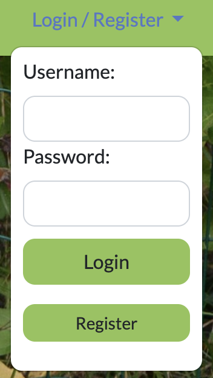
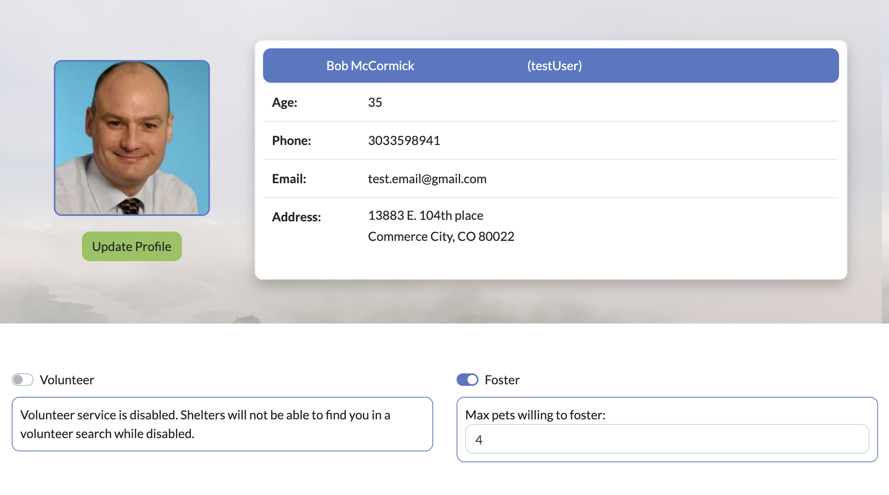
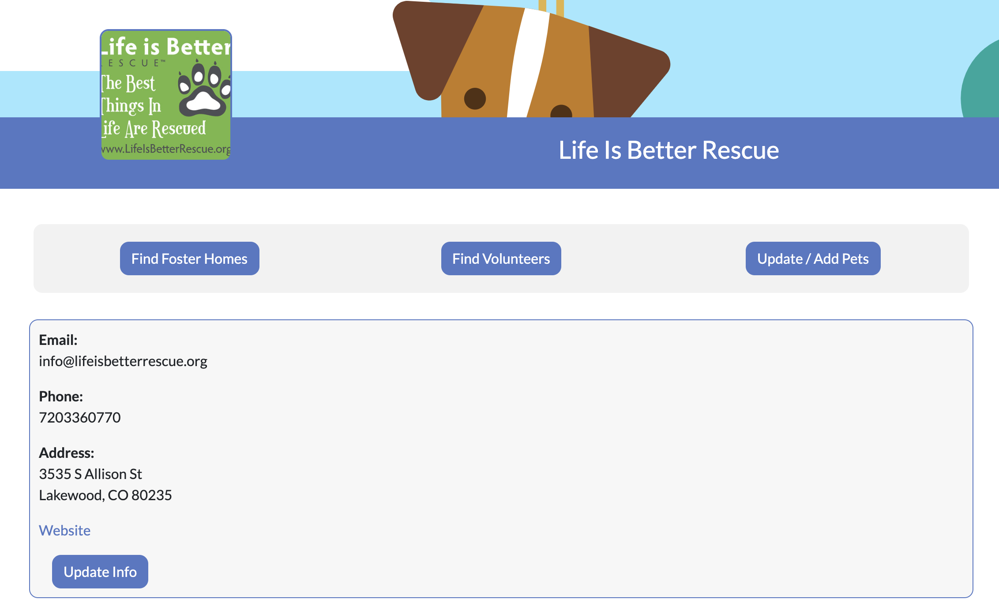
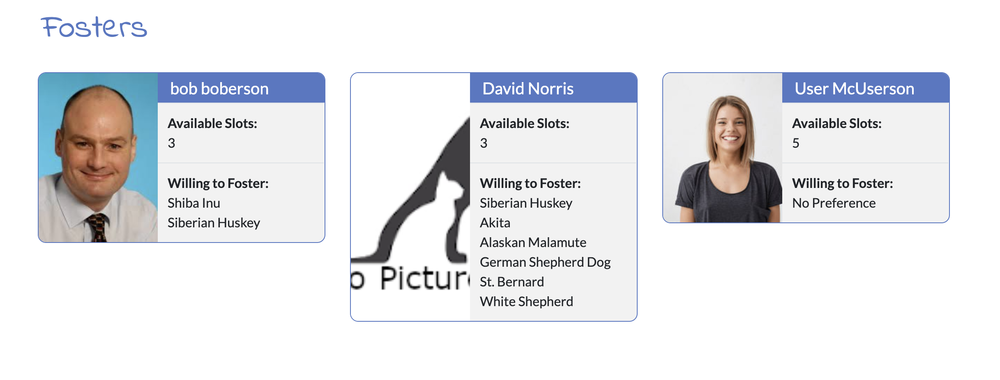
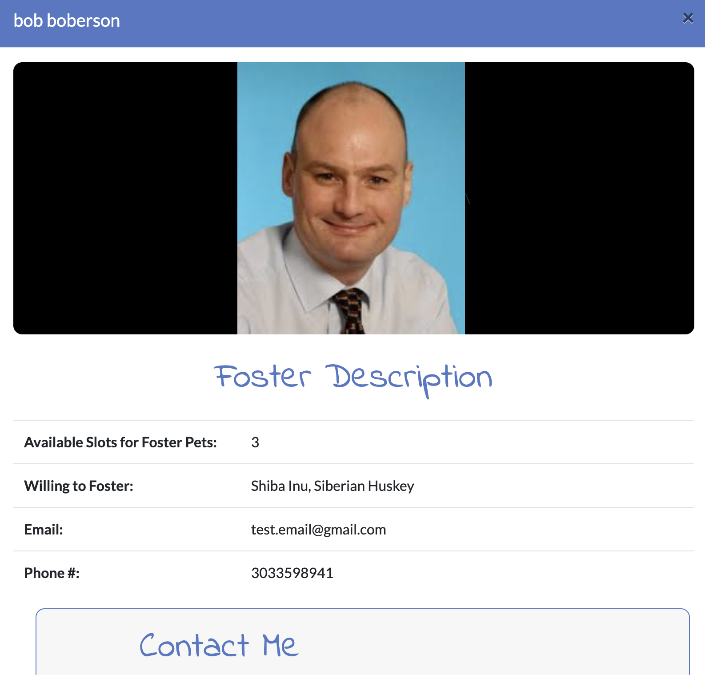
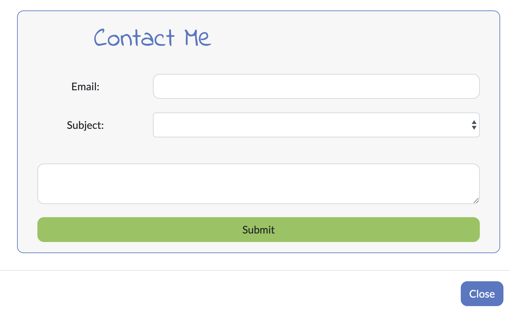
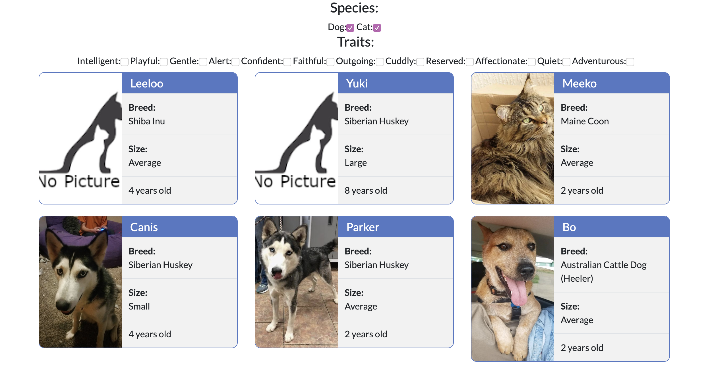
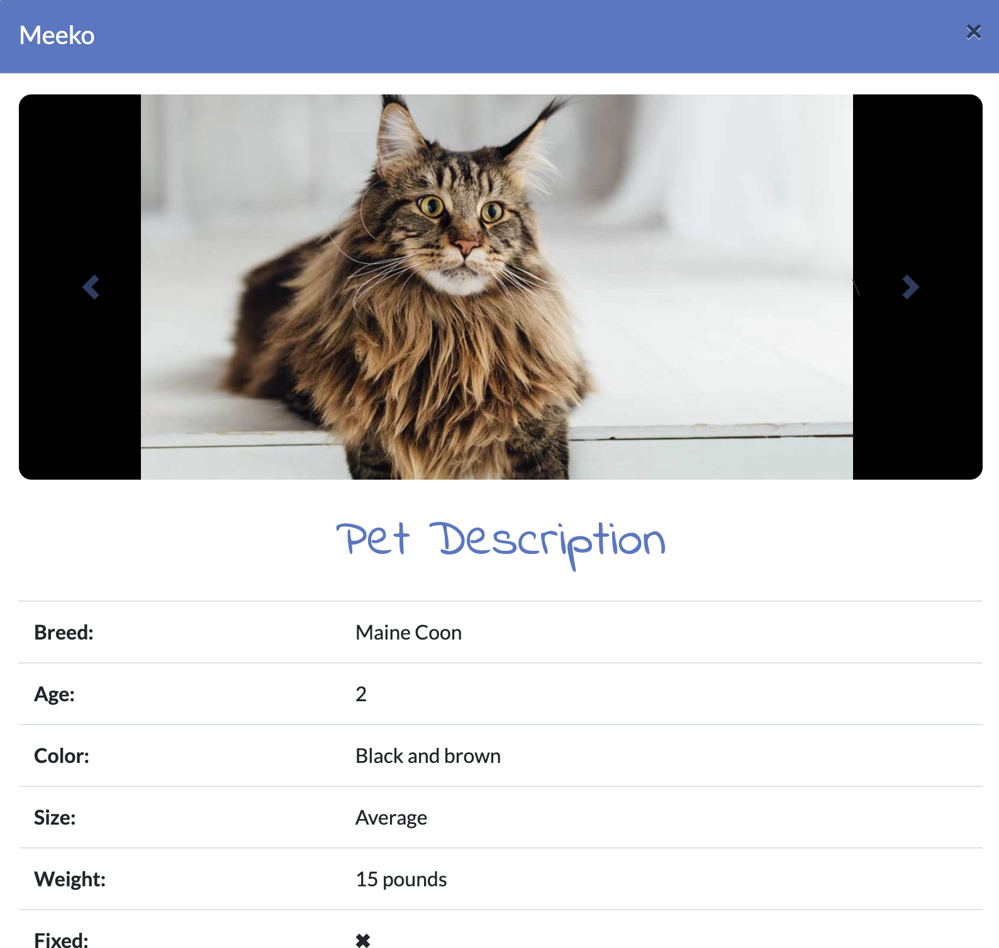
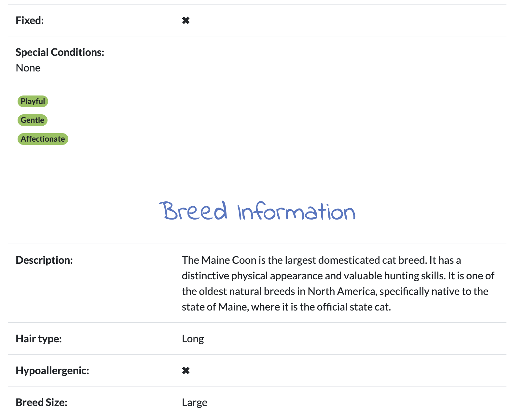
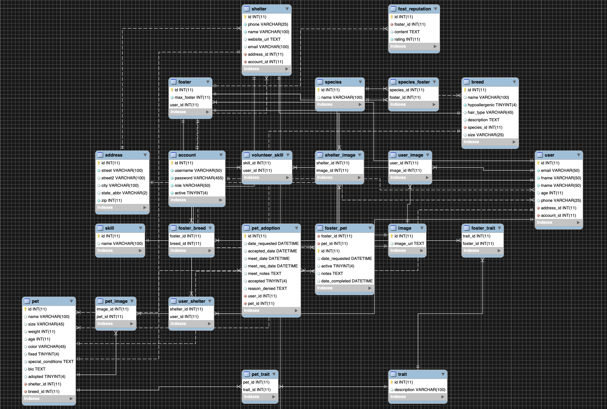

## Furever Friends

### Final Project for Skill Distillery

#### Team Members
* Samantha Haviland (Developer, Scrum Master)
* David Norris (Developer, DBA)
* Zak Saylors (Developer)
* Jacob Shorter-Ivey (Developer, Repo Owner)
* Andrew Wong (Developer)

### Overview

Furever Friends is a full-stack web application primarily built with Java and Angular.
The application's database is manipulated using Spring Data JPA & MySQL and is served on an AWS server.
More information about the technologies used can be found toward bottom of the page.

Furever Friends is a web application where multiple shelters can upload their adoptable pets as well as search for users willing to volunteer their skills or foster pets in their homes. Users can browse local shelters and view pets available for adoption.


### Accessing and Using This Project

Currently, this project is hosted on AWS and can be accessed at **URL HERE**. Some of the operations that can be performed with this project and the URIs to access these operations are listed below.

| CRUD Op. | HTTP Verb | URI                        | Action                                     |
|----------|-----------|----------------------------|--------------------------------------------|
| Read     | GET       | `/api/pet`                 |Displays a list of all pets in the database |
| Read     | GET       | `/api/pet/{id}`            |Displays the pet with matching ID           |
| Read     | GET       | `/api/pet/shelter/{id}`    |Displays all pets by shelter's ID           |
| Read     | GET       | `/api/pet/search/{keyword}`|Displays all pets by shelter's ID           |
| Create   | POST      | `/api/pet/create`          |Creates a pet and adds it to the database   |
| Update   | PUT       | `/api/pet/{id}`            |Updates an existing pet's information       |
| Read     | GET       | `/api/foster/`             |Displays a list of all fosters              |
| Read     | GET       | `/api/foster/species/{sid}`|Displays fosters with a species preference  |
| Create   | POST      | `/api/mail`                |Sends an email via contact box              |

*\*substitute {id}/{sid} for any valid integer representing an item in the database*

*\*substitute {keyword} for any valid string representing the desired query keyword*


### Description

#### Home Page

Upon landing at the home page, a non logged-in user can view all the shelters in the area and search for pets meeting specified conditions. In order to interact with other contact shelters or users, however, you have to create a profile.

To create a profile click the 'Login/Register' dropdown, then click the 'Register' button.




#### User Profile Page



From the user's profile page, they can set their volunteer and foster statuses and update their personal information.


#### Shelter Profile Page

From the shelter's profile page, they can update the shelter's information. Additionally, the shelter control panel is here. Here, the manager of the shelter profile can search for fosters and volunteers, as well as add, update and delete pets from the shelter.




#### Searching for Fosters or Volunteers

A shelter manager can find fosters and volunteers by using the buttons in the control panel. If a foster's/volunteer's card is clicked, then a modal pops up, giving a brief summary of that user's profile. The user can be contacted by the shelter via a contact box in the modal.


*These are the foster search results*


*An example of a foster's pop-up modal*


*The contact boxes for sending emails to potential fosters*


#### Searching for Pets

A user can search for pets by using the convenient search box in the site's navbar or by clicking the 'Search Pets' button on the home page. The 'Search Pets' button will lead the user to a page where they can filter search results to narrow down the species of pet they're looking for, or find pets with certain behavioral traits. Clicking on a pet's search card will bring up a modal with more information about them.


*Results for our "Search Pets" button*


*An example of the modals used for pets*


### Implementation

We used Spring Data JPA to persist the site's data to the database. We designed a database with 20+ tables to handle the operations and storing of information, with room for stretch goals and expansion. Below is an EER Diagram representing our database.




### Technologies and Methodologies Used
```
* Java
* Angular
* RESTful Web Services
* Spring Data JPA
* MySQL
* HTML/CSS
* Bootstrap
* Agile Methodology
* Test-driven Development
* Git/ GitHub
* Spring Tool Suite
* VS Code
* Postman
* MySQL Workbench
* Pair Programming
* Trello
* MAMP
* Gradle
* AWS
* Apache Tomcat
```


### Stretch Goals

Our stretch goals included features like adding a calendar for potential pet adopters looking to schedule meetups with pets, an adoption transaction feature to allow users to begin the adoption process with a shelter on the site, and a reputation system to rate fosters, volunteers, and shelters. These features would round out the functionality of the application and further cement it's identity as a "one stop shop" for a user's pet adoption and sheltering needs.

### Lessons Learned

This project was both challenging and insightful. From the jump, we were ambitious in deciding which features we wanted to include in Furever Friends. Though we may not have had time to implement every one of those ideas, we determined it was important to include them in our wireframes and database schema, so we would have the room to expand if time allowed. Having a solid foundation laid down before writing any code was vital to the project's development, as was our use of Agile methodology and effective communication with our teammates.

A large part of our group's success can be attributed to learning how to delegate tasks, taking and receiving criticism in a positive way, and knowing when to pass off a problem to another group member. Doing these things ensured we broke our problems up into small pieces, where we could solve them quickly, and without having one pair of eyes on an issue for too long. Due to this, we were able to overcome tough challenges like security and authorization with multiple account types, filtering the database's pets by their traits, and directly uploading images from a user's computer.
